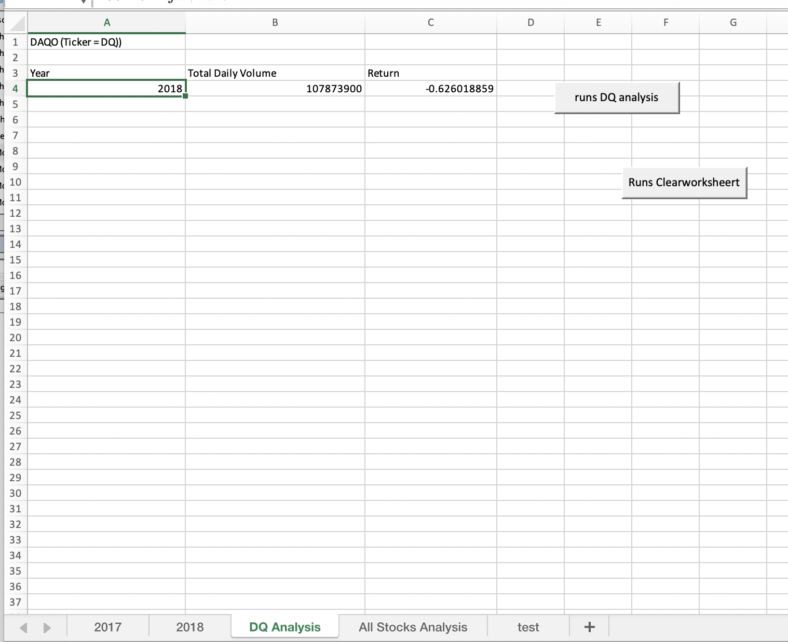
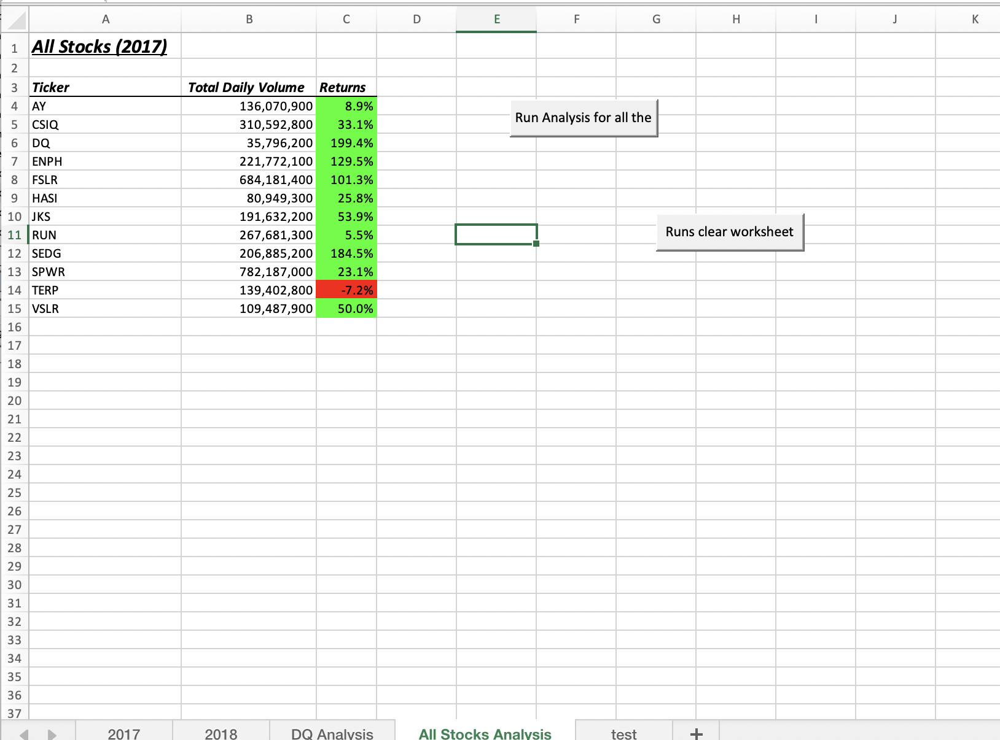
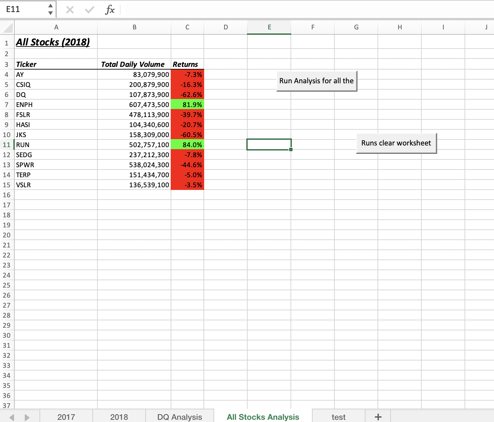
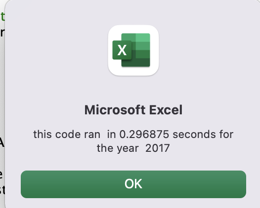
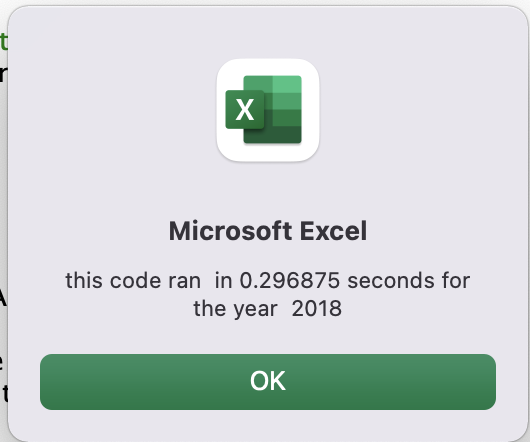
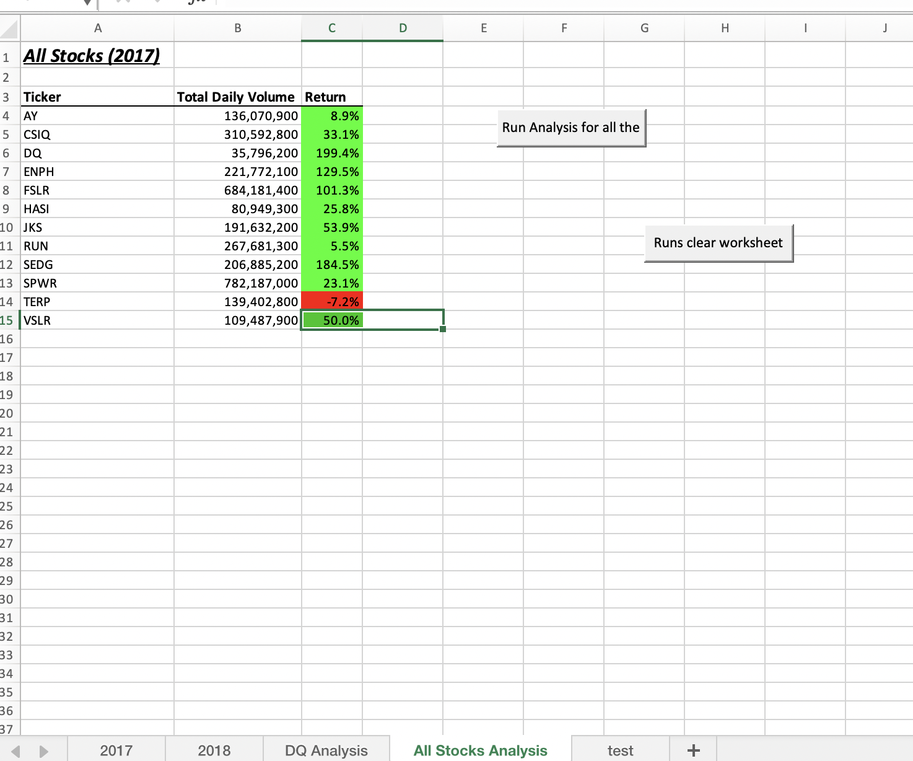
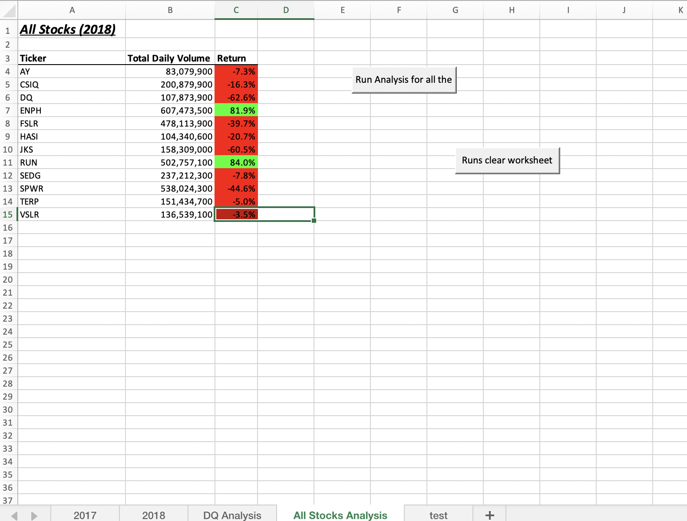
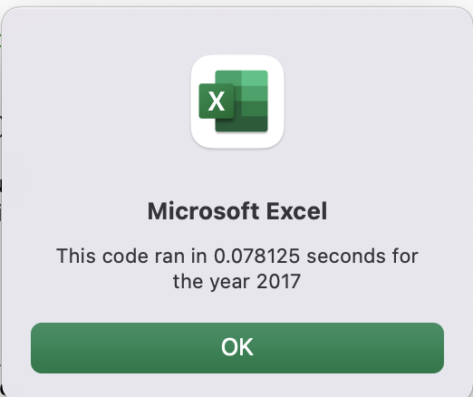
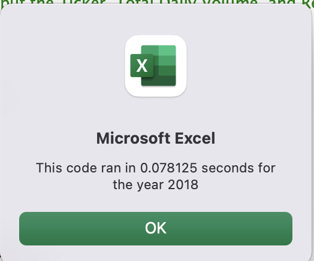

# Stock-Analysis

Analysis on Stock Data

## Overview of the Project 

### Purpose 

The purpose of the project is for Steve to collect stock information of the year 2017 and 2018 to help his parents invest on the stock. There are 2 ways to complete the process - initially completed using simple format and next, created to increase the efficiency of the oriignal code.

The data was stored in 2 sheets (2017 & 2018)  with stock informations of 12 different stocks. The sheets included Ticker name, issued date of the stock, open,high,low, close, adjusted closing, total daily volume and yearly returns  

#### Initial analysis 

Since Steve's parents were interested in investing in DAQO stocks, Created a macro to do  the analysis on DAQO(Ticker = DQ) to retrieve the total daily volume and Yearly returns on DQ stocks for 2018.

 Since the Yearly returns was in negative, created a macro to run the analysis on all stocks data for both 2017 and 2018 to determine which stock will be best for Steve's parents to invest by using Array in the code. 

 
 
 

 Initialized and assigned timer in the code to check the code run time for All stocks analysis 2017 and 2018. 

 

 

## Results 

Using the same macro created for All Stocks Analysis, Refactored the code to increase the efficiency of the code 

Below is the modified code by adding tickerIndex  variable, tickerVolumes(12), tickerStartingPrices(12) and tickerEndingPrices(12) as array's

   
  '1a) Create a ticker Index
    tickerIndex = 0

    '1b) Create three output arrays
    Dim tickerVolumes(12) As Long
    Dim tickerStartingPrices(12) As Single
    Dim tickerEndingPrices(12) As Single
     
    ''2a) Create a for loop to initialize the tickerVolumes to zero.
    For i = 0 To 11
        tickerVolumes(i) = 0
        tickerStartingPrices(i) = 0
        tickerEndingPrices(i) = 0
    Next i

    ''2b) Loop over all the rows in the spreadsheet.
    For i = 2 To RowCount
         
        '3a) Increase volume for current ticker
           tickerVolumes(tickerIndex) = tickerVolumes(tickerIndex) + Cells(i, 8).Value
        
        '3b) Check if the current row is the first row with the selected tickerIndex.
        'If  then
        If Cells(i - 1, 1).Value <> tickers(tickerIndex) And Cells(i, 1).Value = tickers(tickerIndex) Then
           tickerStartingPrices(tickerIndex) = Cells(i, 6).Value
        End If
        'End If
        
        '3c) check if the current row is the last row with the selected ticker
         'If the next row’s ticker doesn’t match, increase the tickerIndex.
        'If  Then
        If Cells(i + 1, 1).Value <> tickers(tickerIndex) And Cells(i, 1).Value = tickers(tickerIndex) Then
           tickerEndingPrices(tickerIndex) = Cells(i, 6).Value
    
         '3d Increase the tickerIndex.
          tickerIndex = tickerIndex + 1

        End If
            
        'End If
    
    Next i
    
    '4) Loop through your arrays to output the Ticker, Total Daily Volume, and Return.
    For i = 0 To 11
        
        Worksheets("All Stocks Analysis").Activate
        Cells(4 + i, 1).Value = tickers(i)
        Cells(4 + i, 2).Value = tickerVolumes(i)
        Cells(4 + i, 3).Value = tickerEndingPrices(i) / tickerStartingPrices(i) - 1
        
    Next i
     
Below are the screenshots of the excel sheets after Refactored code run for All Stocks analysis.

## Summary 

### Advantage and Disadvantage of Refactoring code

Advantage of Refactoring - It helps make the code clean and more organized. Clean code includes design and software improvement and progamming more efficiently. It is easier to read the code.
Disadvantage to refactoring the code - may range from having applications that are too big to not have proper testing scenarios for the existing code, which then might pose risk if we try to refactor the exisitng code. 

### The Advantages of Refactoring code for Stock-analysis project. 

One of the advantage that occurred by refactoring the code was an decrease in code run time. The original analysis for All Stocks Analysis took 0.3 seconds to run whereas our new refactored analysis took  0.07 seconds to run. 

Attached below are the screen shots of the run time for our refactored code analysis. 

